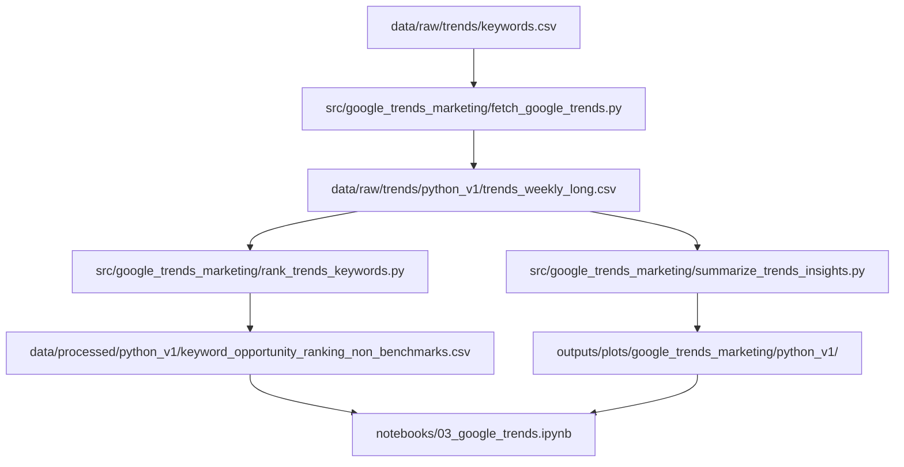

# museum-visitation-ml
SEIS 763 ML project – Museum visitation forecasting using weather, Google Trends, and seasonality

# Museum Visitation Machine Learning Project

## Overview

This project is part of **SEIS 763: Machine Learning**. The goal is to build a machine learning model that predicts **monthly museum visitor counts** using a combination of:

- Museum attendance data  
- Weather data  
- Google Trends (as a marketing/demand proxy)  
- Calendar and seasonal features  

The project simulates a real-world data science workflow, integrating multiple data sources to generate actionable insights about visitor behavior.

---

## Objectives

- Predict monthly museum visitation using machine learning  
- Understand key drivers of attendance (weather, seasonality, demand signals)  
- Estimate the impact of public interest (Google Trends) on visitation  
- Build a reproducible and modular ML pipeline  

---

## Project Structure

```text
museum-ml-project/
│
├── README.md
├── requirements.txt
├── .gitignore
│
├── data/
│   ├── raw/
│   │   ├── museum/
│   │   ├── weather/
│   │   ├── trends/
│   │   └── calendar/
│   └── processed/
│       ├── museum_monthly.csv
│       ├── weather_monthly.csv
│       ├── trends_monthly.csv
│       ├── calendar_monthly.csv
│       ├── final_dataset.csv
│       └── model_dataset.csv
│
├── notebooks/
│   ├── 01_museum_data.ipynb
│   ├── 02_weather_data.ipynb
│   ├── 03_google_trends.ipynb
│   ├── 04_calendar_features.ipynb
│   ├── 05_feature_engineering.ipynb
│   ├── 06_modeling.ipynb
│   └── 07_presentation_visuals.ipynb
│
├── src/
│   ├── build_dataset.py
│   ├── features.py
│   ├── model.py
│   ├── utils.py
│   └── google_trends_marketing/
│       ├── fetch_google_trends.py
│       ├── rank_trends_keywords.py
│       ├── summarize_trends_insights.py
│       ├── run_trends_versioned.py
│       └── import_google_trends_exports.py
│
├── outputs/
│   ├── plots/
│   │   └── google_trends_marketing/
│   │       └── python_v1/
│   ├── tables/
│   └── models/
│
└── docs/
    ├── proposal.docx
    ├── presentation_outline.md
    ├── final_notes.md
    └── google_trends_marketing/
        ├── avila_marketing_research.md
        ├── google_trends_notes.md
        ├── google_trends_chunked_runbook.md
        └── sources.md

    ---

## Data Sources

### Museum Visitor Data
- Kaggle dataset of monthly museum visitors  
- Target variable: `visitors`

### Weather Data
- Meteostat or NOAA  
- Features:
  - Average temperature  
  - Total precipitation  
  - Wind speed  

### Google Trends Data (Marketing Proxy)
- Search interest data representing public demand  
- Keywords:
  - "Los Angeles museums"
  - "things to do in Los Angeles"
  - "Los Angeles attractions"
  - "family activities Los Angeles"
- Current Google Trends implementation in this branch focuses on **Avila Adobe** first, with a small benchmark set for context:
  - Avila Adobe / Olvera Street brand and discovery terms
  - Historical-significance terms such as "oldest house in Los Angeles"
  - Lifestyle/history curiosity terms such as "living history museum"
  - A small benchmark set including Getty Museum, La Brea Tar Pits, and Griffith Observatory
- Versioned Google Trends workflow:
  - scripts live in `src/google_trends_marketing/`
  - notes and sources live in `docs/google_trends_marketing/`
  - committed plots live in `outputs/plots/google_trends_marketing/python_v1/`
  - current baseline processed outputs live in `data/processed/python_v1/`
- Legacy non-versioned local outputs may still exist in some working copies, but the intended branch structure now uses the versioned `python_v1` folder.
- Supporting notes and sources:
  - `docs/google_trends_marketing/google_trends_notes.md`
  - `docs/google_trends_marketing/avila_marketing_research.md`
  - `docs/google_trends_marketing/google_trends_chunked_runbook.md`
  - `docs/google_trends_marketing/sources.md`
- Current `python_v1` files include:
  - `data/raw/trends/keywords.csv`
  - `data/raw/trends/python_v1/trends_weekly_long.csv`
  - `data/processed/python_v1/trends_monthly_long.csv`
  - `data/processed/python_v1/trends_monthly.csv`
  - `data/processed/python_v1/trends_monthly_dataset.csv`
  - `data/processed/python_v1/trends_monthly_available_only.csv`

### Google Trends Lane Flow


### Calendar Features
- Month
- Seasonality indicators
- Holiday flags

---

## Data Workflow

1. Each team member builds a dataset  
2. Each dataset must:
   - Be monthly  
   - Include `month` column (`YYYY-MM`)  
3. Merge datasets:

```python
df = museum.merge(weather, on="month", how="left")
df = df.merge(trends, on="month", how="left")
df = df.merge(calendar, on="month", how="left")

## Feature Engineering

- `visitors_lag1` (previous month)  
- `visitors_lag12` (previous year)  
- `rolling_mean_3`  
- Seasonal features  

---

## Machine Learning Model

- Linear Regression (baseline)

### Target
- Monthly museum visitors  

### Inputs
- Weather  
- Trends  
- Calendar  
- Lag features  

---

## Evaluation Metrics

- MAE (Mean Absolute Error)  
- RMSE (Root Mean Squared Error)  
- R² Score  

---

## How to Run

### Clone repo
```bash
git clone https://github.com/Andy-FireClimWx/museum-ml-project.git
cd museum-ml-project

## Setup & Execution

### Create environment
```bash
python -m venv .venv
.venv\Scripts\activate   # Windows
# or
source .venv/bin/activate   # Mac/Linux

### Install Packages
```bash
pip install -r requirements.txt

### Build Google Trends dataset
```bash
python src/google_trends_marketing/fetch_google_trends.py
```

If Google rate-limits the API after a successful raw pull, rebuild the monthly outputs from the cached raw file:

```bash
python src/google_trends_marketing/fetch_google_trends.py --use-existing-raw
```

If a longer pull is interrupted, resume from the partially saved raw CSV:

```bash
python src/google_trends_marketing/fetch_google_trends.py --resume-existing-raw
```

### Build keyword ranking
```bash
python src/google_trends_marketing/rank_trends_keywords.py
```

### Print summaries and save plots
```bash
python src/google_trends_marketing/summarize_trends_insights.py
```

This summary script prints:
- top-ranked available terms
- theme-level opportunity summaries
- terms still waiting on live fetch
- quick visitor-alignment correlations for Avila Adobe

It also saves plots to:
- `outputs/plots/google_trends_marketing/top_keyword_opportunities.png`
- `outputs/plots/google_trends_marketing/avila_vs_top_trends.png`
- `outputs/plots/google_trends_marketing/theme_opportunity_scores.png`

### Recommended: run everything into a versioned folder
```bash
python src/google_trends_marketing/run_trends_versioned.py --run-label python_v1 --use-existing-raw
```

This writes a self-contained run to:
- `data/processed/python_v1/`
- `data/raw/trends/python_v1/`
- `outputs/plots/google_trends_marketing/python_v1/`

For a new run, change the label:
```bash
python src/google_trends_marketing/run_trends_versioned.py --run-label python_v2 --resume-existing-raw
```

---

## Team Roles

- Project Lead  
- Weather Data  
- Google Trends  
- Museum Data  
- Feature Engineering  
- Modeling  
- Presentation  

---

## Key Insights (Expected)

- Strong seasonal patterns  
- Weather impacts attendance  
- Google Trends reflects demand  
- Lag features improve predictions  

---

## Notes

- All datasets must use `month` format (`YYYY-MM`)  
- Missing values handled after merging  
- COVID period handled during modeling  